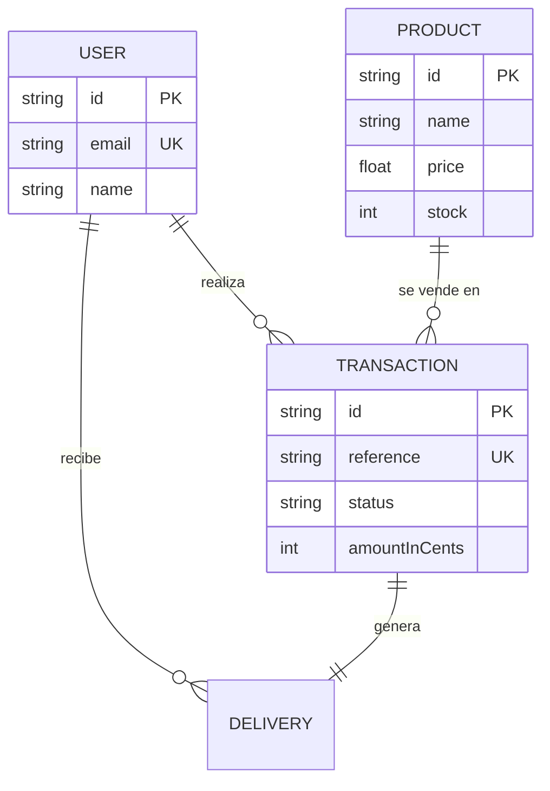

# Prueba Técnica - Tienda con Wompi

## Demo

- Frontend: https://main.d3ojpcu7nr3230.amplifyapp.com/
- Backend: http://54.81.5.152:3000
- Swagger: http://54.81.5.152:3000/api/docs

## Stack

- Frontend: React + Redux Toolkit + Tailwind
- Backend: NestJS + Prisma + PostgreSQL
- Infraestructura: Docker + AWS (S3, RDS, ECS, ECR, Amplify)

## Instalación local

### Backend

1. Entrar a la carpeta: `cd server-prueba`
2. Copiar variables: `cp .env.example .env`
3. Iniciar con Docker: `docker compose up --build`
4. Poblar base de datos (Opcional): `curl -X POST http://localhost:3000/api/product/seed`

### Frontend

1. Entrar a la carpeta: `cd client-prueba`
2. Instalar dependencias: `npm install`
3. Iniciar: `npm run dev`

## Modelo de datos

El sistema gestiona la persistencia mediante Prisma con las siguientes relaciones:



## Pruebas unitarias

Cobertura superior al 85% en los flujos críticos de negocio.

### Frontend

```text
-------------------|---------|----------|---------|---------
Métrica            | % Stmts | % Branch | % Funcs | % Lines
-------------------|---------|----------|---------|---------
Total              |   93.58 |    85.04 |   89.82 |   94.58
-------------------|---------|----------|---------|---------
```

### Backend

```text
------------------------------------|---------|----------|---------|---------|
File                                | % Stmts | % Branch | % Funcs | % Lines |
------------------------------------|---------|----------|---------|---------|
All files                           |   92.41 |    82.14 |   88.23 |   90.52 |
 payment/application                |     100 |      100 |     100 |     100 |
 payment/infrastructure/persistence |     100 |    63.63 |     100 |     100 |
 product/domain                     |     100 |      100 |     100 |     100 |
 product/infrastructure/persistence |   93.33 |      100 |      90 |      92 |
------------------------------------|---------|----------|---------|---------|
```

Para ejecutar localmente:

- Frontend: `cd client-prueba && npm run test:coverage`
- Backend: `cd server-prueba && npm run test:cov`

## Arquitectura

Se utiliza Arquitectura Hexagonal para desacoplar la lógica de negocio de los agentes externos:

- **Dominio:** Entidades y contratos (interfaces).
- **Aplicación:** Casos de uso y lógica de servicios.
- **Infraestructura:** Adaptadores para Prisma, Wompi, AWS S3 y controladores de entrada.
- **Presentación:** Interfaz de usuario y componentes React.

## Variables de entorno

- `PORT`: Puerto de la aplicación.
- `AWS_REGION`, `AWS_ACCESS_KEY_ID`, `AWS_SECRET_ACCESS_KEY`, `AWS_S3_BUCKET_NAME`: Credenciales y bucket S3.
- `BASE_URL`, `PUBLIC_KEY`, `PRIVATE_KEY`, `INTEGRITY_SECRET`: Credenciales de Wompi.
- `POSTGRES_HOST`, `POSTGRES_USER`, `POSTGRES_PASSWORD`, `POSTGRES_DB`: Configuración de PostgreSQL.
- `DATABASE_URL`: URL de conexión completa para Prisma.
